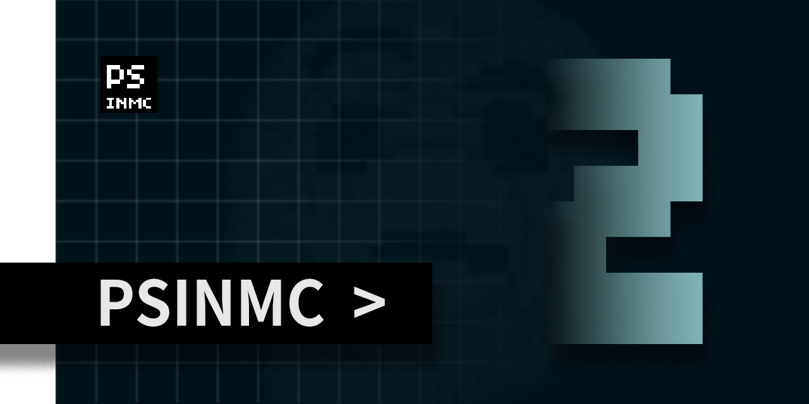
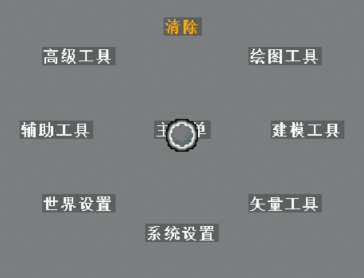

# PSINMC-2  （施工中）



PSINMC（简称PS包或PS）是一个在MC中进行画图、建筑、地形的**多人原版模组**。你可以使用如笔刷、填充等常见的画图进行方块作画，也可以使用立方体、球体、3D画笔等工具创建立体模型。结合钢笔、锚点等路径工具创建的矢量路径可以进行矢量绘图等对笔刷路径有高精度要求的操作。此外，还提供自定义工具、L-系统等独特的工具，结合原版命令快速完成特殊操作，拥有极高的便利性与自由度。

> **模组版本：0.2.1**  
> **游戏要求：1.17(21w15a)+**

---

说明：

- 默认你拥有服务器OP权限（能够使用指令）
- 下文所有有关按键的描述除特殊说明均为MC原版默认键位
- 为描述简便，下文的鼠标单击、拖动等若无特殊说明操作均指<kbd>鼠标右键</kbd>

## **目录**

- [安装与使用](#安装与使用)
- [特性简介](#特性简介)
  - [菜单](#菜单)
  - [工具](#工具)
- [技术信息](#技术信息)
  - [模组信息](#模组信息)
  - [模组卸载](#模组卸载)

## **安装与使用**

### **安装**

数据包及配套资源包从[#TODO](#TODO)下载，安装方法请参考 [原版模组安装指南](https://www.mcbbs.net/thread-912853-1-1.html) (@ruhuasiyu)

### **使用**

PSINMC是一个建造型原版模组，因此需要在创造模式下使用，并且使用者最好拥有服务器OP权限。

为了减小服务器负担和明确服务对象，**PS包的使用者需要通过手动输入命令进行初始化**：

```mcfunction
function ps:players/init
```

或使用以下命令为其他玩家进行初始化：

```mcfunction
execute as <player> run function ps:players/init
```

## **特性简介**

### **菜单**

PS包拥有较为完善的菜单系统，你可以使用它分门别类地获取工具，或快速地更改系统设置。



菜单默认按下<kbd>左Shift</kbd>键呼出，移动鼠标使视线中心对准即可选中目录项，选中目录项后抬起<kbd>左Shift</kbd>键退出目录即可执行选中项对应的操作。也可以在选中目录项的同时点击<kbd>鼠标左键</kbd>以在不退出目录的情况下执行相应的操作。

可以通过双击<kbd>左Shift</kbd>键将菜单呼出方式设置为双击<kbd>左Shift</kbd>键，或在菜单中使用 _主菜单->系统设置->切换热键_ 进行切换

[菜单详细文档](./article/menu.md)

### **工具**

PS包的工具大致分为绘图工具，建模工具，矢量工具，高级工具，辅助工具五类。这些工具都可以通过主菜单选取得到。


[工具详细文档](./article/tools.md)

## **技术信息**

### **模组信息**

|                   |                       |
|-                  |-                      |
|命名空间           |PS                     |
|UUID保留范围       |0-0110-5053-x-x        |
|主世界占用区块     |(29999984,2992)        |
|主世界强制加载区块 |(0,0)  (29999984,2992) |

### **模组卸载**

这部分内容通常用于作品发布前的善后工作，如果你不在意PS对这个世界的一些细节上的改动则可以忽略。

使用命令卸载PS包：

```mcfunction
function ps:main/unload
```

这会移除PS在这个世界所注册的所有计分板，清除实体标记，移除bossbar，清理辅助方块（位于区块29999984,2992，世界边界之外）等，但是注意，PS包加载时更改的游戏规则(`gamerules`)不会自动恢复，如有必要请检查以下游戏规则：

- `sendCommandFeedback`
- `maxCommandChainLength`
- `doDaylightCycle`
- `doWeatherCycle`
